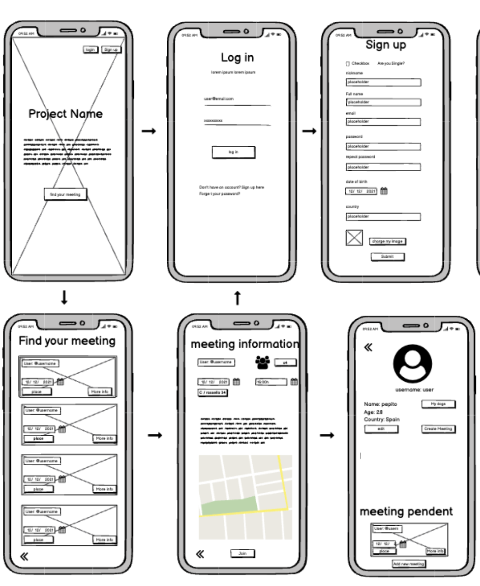

# FitFun

## Description

​
This repository is the REST API for the [frontend repository](https://github.com/xavireina/Frontend-jwt). 

### setup .env

You need to setup the `.env` like `.env.sample`
​

### Install the app

```
npm install
```

​
### Run the app

```
npm run start
```


## User Stories

404 - As a user I want to see a nice 404 page when I go to a page that doesn’t exist so that I know it was my fault

500 - As a user I want to see a nice error page when the super team screws it up so that I know that is not my fault

Homepage - As a user I want to be able to access the homepage so that I see what the app is about and login and signup

Sign up - As a user I want to sign up on the webpage so that I can see all the events that I could attend

Login - As a user I want to be able to log in on the webpage so that I can get back to my account

Logout - As a user I want to be able to log out from the webpage so that I can make sure no one will access my account

Meetings list - As a user I want to see all the meetings available so that I can choose which ones I want to join

Meetings detail - As a user I want to see the meeting details and attendee list of one meerting so that I can decide if I want to join

Join Meetings - As a user I want to be able to join to meetings so that the organizers can count me in


## Backlog

​Catalog filter - As a user I want to be able to carry out a search for meetings in my area​

To be able to join meetings - As a user I want to be able to join preexisting meetings​

Meetings in which I have participated - As a user I want to see the meetings I have been on previously​


## ROUTES:

| Name|	Method|	Endpoint|Description |Body | Redirects|
|---------|---|---|---|---|---|
|Home	 |GET	 |/	 | See the main page	|	| |
|Log in form	|GET	| /login	| See the form to log in		|||
|Log in	|POST	| /login	|Log in the user	||	/|
|Sign Up form	| GET	|/signup	 | See the form to sign up		||
|Sign Up|POST	|/signup	 | Sign up a user	|{mail, password, name, age, gender, image}|	/profile|
|Log out|POST	| /logout	|Log out a user		|{userId}| /
|Profile |GET	| /profile	|See the profile page with editable form||
|Edit Profile 	| PUT	| /profile/:userId	 | Send user's data changed	|{mail, password, name, age, gender, image} |	/profile|
|Meetings|GET	| /meetings | All meetings available to join	|	|
|Join Meeting	|POST	 |/meetings/:id/join	|Join a meeting	| {user}|	/meetings ||
|View meeting	|GET	 |/meetings/:id	|View a meeting	| |	 ||


## Models

​User model​

{
 email: String,
 hashedPassword: String,
 name: String,
 age: Number,
 img: [DATA],
 gender: ENUM
}

​Meeting model​

{
 name: String,
 description: String,
 datetime: Datetime,
 duration: String,
 location: Array,
 imgMaps: String,
 users: [String]
}


## ​Wireframes




## Links

- [Slides]()
- [Frontend repository]()
- [Deployed version]()


